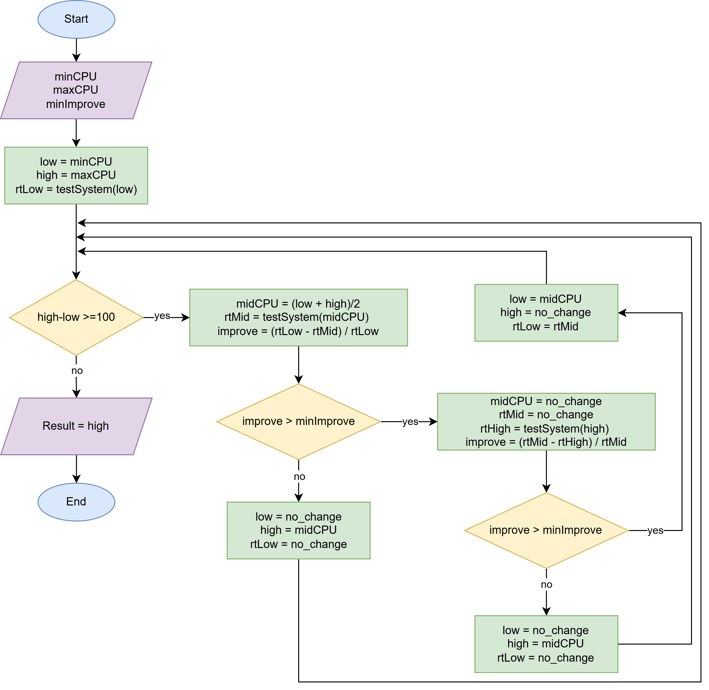

# RECON
Resource Engine for CPU Operational Normalization

## Google kube-Startup-CPU-Boost

### Overview
`kube-startup-cpu-boost` is a Kubernetes controller designed to dynamically increase CPU requests and limits for containers specifically during their startup phase. By temporarily allocating more CPU, it significantly reduces application startup latency and prevents aggressive CPU throttling, seamlessly scaling back to standard resource constraints once the application is ready.

### The Current Landscape & Weak Points
While the core concept of a startup CPU boost is effective, the existing implementation has several structural and operational limitations:

- **Limitation 1**: Hardcoded threshold values that lack environment-specific flexibility

- **Limitation 2**: Inefficient state tracking leading to delayed resource withdrawal after the startup phase ends.

### Proposed Improvements
To address these bottlenecks, this project introduces a refined architecture optimized for high-concurrency environments.

**Key Enhancements**:

- **Active-Polling** `durationPolicy`: Replaces the original passive `wait-time` with a proactive, application-aware trigger. By introducing a new `durationPolicy` type, the controller actively polls a specified internal API endpoint (via HTTP/gRPC) and immediately withdraws boosted resources once a specific "ready" payload or status code is detected, ensuring zero-latency resource reclamation. [See more](https://github.com/kenphunggg/kube-startup-cpu-boost.git)

- **Intelligent Resource Profiling**: Replaces static, hardcoded values with a Dynamic Range Strategy. The controller automatically selects the optimal CPU limit from a user-defined range based on real-time node capacity and workload requirements

## The New Custom Resource Definition (CRD) - RECON

To provide granular control over how and when the CPU boost is applied, we introduced the `StartupCPUBoost` CRD.

### What it does

This CRD allows cluster administrators and developers to define:

- The target workload (Deployment, StatefulSet, etc.).

- The range of value for the CPU boost.

- The specific conditions or probes that signal the end of the "startup" phase.

```yaml
apiVersion: lazyken.io/v1alpha1
kind: Recon
metadata:
  name: boost-001
  namespace: serverless
selector:
  matchExpressions:
  - key: serving.knative.dev/service
    operator: In
    values: ["measure-yolo"]
spec:
  resourcePolicy:
    containerPolicies:
    - containerName: user-container
      resourceRange:
        limits:
          min: "200m"
          max: "2"
  durationPolicy:
    apiCondition:
      url: "http://measure-yolo.serverless.svc.cluster.local/status"
      response: "READY"
```

### Architecture & Flow chart


